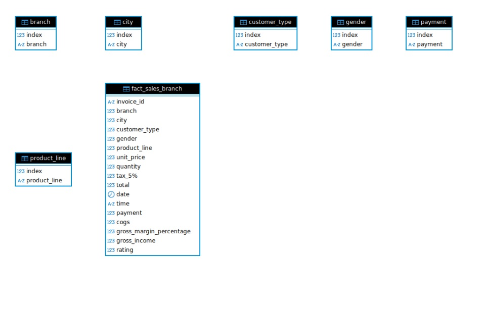
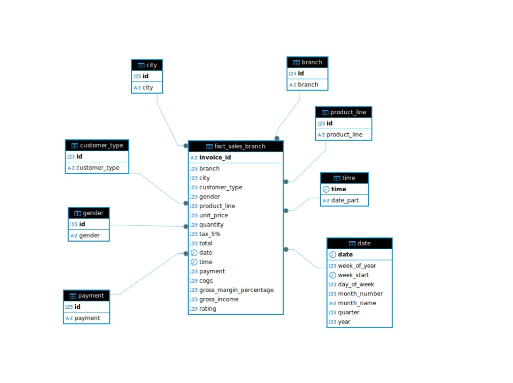

# ДИПЛОМ
Дипломная работа ETL. (Нетология)

## Описание проекта
Цель проекта: составить документацию процессов ETL на основе предложенного датасета

Ход работы: 
* Анализ данных (описание данных, небольшой анализ)
* Формирование NDS, DDS, STG, MART схем
* Формирование ETL процесса
* Формирование дашбордов

## 1.Анализ данных
__Продажи в Супермаркете (описание данных).__

__Контекст:__ Число супермаркетов в большинстве густонаселенных городов растет, а конкуренция на рынке также высока. Набор данных представляет собой данные об исторических продажах компании-супермаркета, которые были зарегистрированы в 3 разных филиалах за 3 месяца. С этим набором данных легко применять методы прогнозного анализа данных.

### Информация об атрибутах:

__Идентификатор счета-фактуры:__ сгенерированный компьютером идентификационный номер счета-фактуры на товарном чеке.

__Филиал:__ Филиал суперцентра (доступны 3 филиала, обозначенные как __A__, __B__ и __C__)

__Город:__ Местоположение супермаркетов.
__Тип клиента:__ Тип клиентов, зарегистрированный участниками для клиентов, использующих карту участника, и обычный для клиентов, не имеющих карты участника.

__Пол:__ Гендерный тип клиента.
__Продуктовая линейка:__ 
* Общие категории товаров 
* Электронные аксессуары
* Модные аксессуары
* Продукты питания и напитки
* Здоровье и красота
* Дом и стиль жизни
* Спорт и путешествия
	
__Цена за единицу:__ Цена каждого продукта в долларах США.

__Количество:__ Количество продуктов, приобретенных клиентом.

__Налог:__ налоговый сбор в размере 5% при покупке клиентом.

__Итого:__ Общая стоимость, включая налоги.

__Дата:__ Дата покупки (запись доступна с января 2019 года по март 2019 года).

__Время:__ Время покупки (с 10 утра до 9 вечера).

__Оплата:__ Платеж, используемый клиентом для совершения покупки (доступны 3 способа – наличные, кредитная карта и электронный кошелек).

__COGS:__ Стоимость проданных товаров.

__Процент валовой прибыли:__ Процент валовой прибыли от продажи.

__Валовой доход:__ Валовой доход.

__Рейтинг:__ Оценка стратификации покупателей по их общему впечатлению от покупок (по шкале от 1 до 10) 

## Небольшой анализ

Размер таблицы(строки, столбцы):    
Общая информация о Данных:     
Пропуски в данных: 

Вывод: таблица состоит из 1000 строк и 17-ти столбцов, данные чистые, нет пропусков. 

### Формирование схем

Слои хранилища данных:

* В __NDS__ слое у нас будут данные в нормализованной форме 3NF (таблица фактов и измерений) без ключей.
* В __DDS__ слое будут данные из таблицы фактов и измерений __NDS__ слоя с соответсвующими форматами, ключами при этом данные строго будут уникальными без повторов. После каждого обновления будут вносится только новые данные. 
* В __STG__ слое будут сгенерированные данные, для которых применится ETL процесс и данные попадут в __DDS__ слой.
* В __MART__ слое будут сформированы представления для дальнейшего формирования Dashboards.

NDS диаграмма выглядит так: 
DDS диаграмма выглядит так: 
