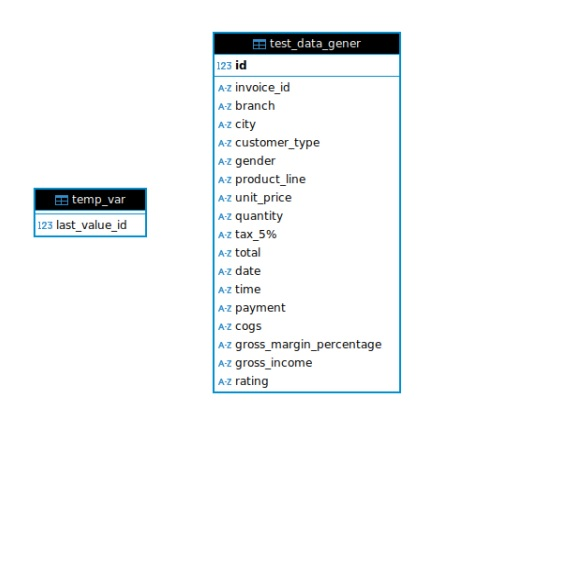
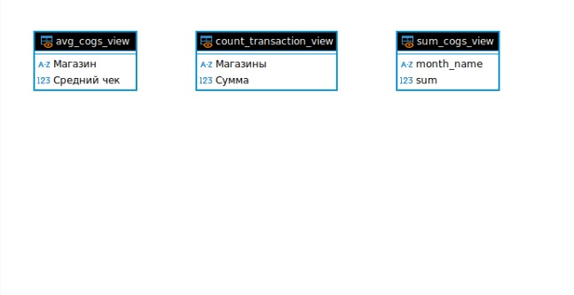
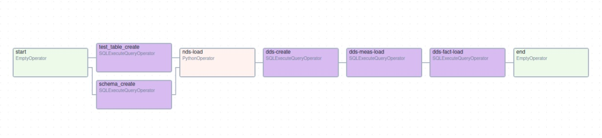
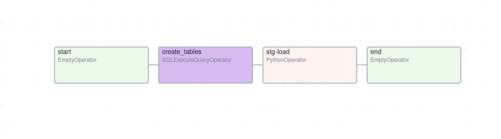

# ДИПЛОМ
Дипломная работа ETL. (Нетология)

## Описание проекта
Цель проекта: составить документацию процессов ETL на основе предложенного датасета

Ход работы: 
* Анализ данных (описание данных, небольшой анализ)
* Формирование NDS, DDS, STG, MART схем
* Формирование ETL процесса
* Формирование дашбордов

## 1.Анализ данных
__Продажи в Супермаркете (описание данных).__

__Контекст:__ Число супермаркетов в большинстве густонаселенных городов растет, а конкуренция на рынке также высока. Набор данных представляет собой данные об исторических продажах компании-супермаркета, которые были зарегистрированы в 3 разных филиалах за 3 месяца. С этим набором данных легко применять методы прогнозного анализа данных.

## Информация об атрибутах:

__Идентификатор счета-фактуры:__ сгенерированный компьютером идентификационный номер счета-фактуры на товарном чеке.

__Филиал:__ Филиал суперцентра (доступны 3 филиала, обозначенные как __A__, __B__ и __C__)

__Город:__ Местоположение супермаркетов.

__Тип клиента:__ Тип клиентов, зарегистрированный участниками для клиентов, использующих карту участника, и обычный для клиентов, не имеющих карты участника.

__Пол:__ Гендерный тип клиента.

__Продуктовая линейка:__ 
* Общие категории товаров 
* Электронные аксессуары
* Модные аксессуары
* Продукты питания и напитки
* Здоровье и красота
* Дом и стиль жизни
* Спорт и путешествия
	
__Цена за единицу:__ Цена каждого продукта в долларах США.

__Количество:__ Количество продуктов, приобретенных клиентом.

__Налог:__ налоговый сбор в размере 5% при покупке клиентом.

__Итого:__ Общая стоимость, включая налоги.

__Дата:__ Дата покупки (запись доступна с января 2019 года по март 2019 года).

__Время:__ Время покупки (с 10 утра до 9 вечера).

__Оплата:__ Платеж, используемый клиентом для совершения покупки (доступны 3 способа – наличные, кредитная карта и электронный кошелек).

__COGS:__ Стоимость проданных товаров.

__Процент валовой прибыли:__ Процент валовой прибыли от продажи.

__Валовой доход:__ Валовой доход.

__Рейтинг:__ Оценка стратификации покупателей по их общему впечатлению от покупок (по шкале от 1 до 10) 

## Небольшой анализ

Размер таблицы(строки, столбцы):

   

Общая информация о Данных:

    

Пропуски в данных:

Вывод: таблица состоит из 1000 строк и 17-ти столбцов, данные чистые, нет пропусков. 

## Формирование схем

Слои хранилища данных:

* В __NDS__ слое у нас будут данные в нормализованной форме 3NF (таблица фактов и измерений) без ключей.
* В __DDS__ слое будут данные из таблицы фактов и измерений __NDS__ слоя с соответсвующими форматами, ключами при этом данные строго будут уникальными без повторов. После каждого обновления будут вносится только новые данные. 
* В __STG__ слое будут сгенерированные данные, для которых применится ETL процесс и данные попадут в __DDS__ слой.
* В __MART__ слое будут сформированы представления для дальнейшего формирования Dashboards.

NDS диаграмма выглядит так: 

DDS диаграмма выглядит так: 

STG диаграмма выглядит так: 

MART диаграмма выглядит так: 

## Формирование ETL процесса

В качестве оркестратора данных выбран Aiflow, а его базой данных PostgreSQL

Структурная схема примерно выглядит так:

Первый наш и основной DAG (ориентированный ациклический граф) выглядит следующим образом:

А его код можно посмотреть по следующей [ссылке](dags/DAG_etl.py)

Разберём его на составляющие:

* __start__ - __EmptyOperator__ это пустой оператор, который не выпоняет какой либо код. Он показывает старт выполнения графа
* __test_table_create__ и __schema_create__ - С помощью оператора __SQLExecuteQueryOperator__ выполним пару запросов к базе данных, а именно:
  1. Создадим схемы хранилища данных __DDS__, __NDS__, __STG__ (схему __MART__ я не стал включать в таски, создадим её и представления отдельно выпонив запросы из [файла](dags/tasks/MART/views.sql) например в __DBeaver__)
  2. Создадим в схеме __STG__ пару таблиц для другого DAGа, который будет генерить данные для нашего __DWH__ в эти таблицы, тем самым искуственно создаём источник данных.
* __nds-load__ - __PythonOperator__ сдесь мы делаем все необходимые преобразования ETL процесса (выгружаем данные из первого источника [файл](data/supermarket_sales-Sheet1.csv), преобразовываем и загружаем в
     __NDS__ слой затем файл удаляем. Источники данных обрабатываются по очереди, [второй](dags/tasks/etl/test_data/test_data_gener.py) источник данных обработается, когда __DAG__ снова запустится планировщиком 	при этом файл недолжен находится в папке __data__. Код __NDS__ слоя можно посмотреть по [ссылке.](dags/tasks/etl/etl_nds_def.py)
* __dds-create__ - __SQLExecuteQueryOperator__ - создание таблицы фактов и измерений в __DDS__ слое, если они были не созданы
* __dds-meas-load__ - __SQLExecuteQueryOperator__ - заполняем таблицы измерений из __NDS__ слоя
* __dds-fact-load__ - __SQLExecuteQueryOperator__ - заполняем таблицу фактов из __NDS__ слоя
* __end__ - __EmptyOperator__ это пустой оператор, показывающий окончание графа __DAGа__

Второй DAG выглядит следующим образом:

Код можно посмотреть по следующей [ссылке](dags/DAG_test_data.py)

Этот __DAG__ формирует второй источник данных, запускается каждую минуту и генерирует уникальных 10 строк.

Разберём его на составляющие:

* __start__ - __EmptyOperator__ это пустой оператор.
* __create_tables__ - __SQLExecuteQueryOperator__ создаём

     
